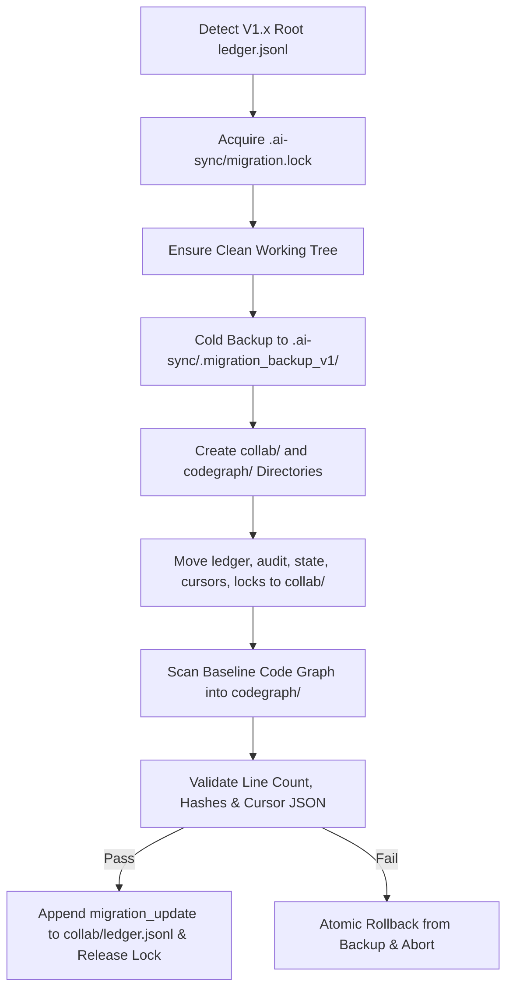

# Dual Agent Sync (V2.0)

## 1. Purpose & Core Overview

Use this skill when multiple AI IDEs (Trae, Codex, Cursor, Windsurf, Cline) or coding agents collaborate on the same repository.

Dual Agent Sync V2.0 strictly splits repository-local state into **two independent modular sub-systems** under `.ai-sync/`:

```text
.ai-sync/
├─ collab/                                # 模块一：项目协同子系统 (Project Collaboration)
│  ├─ ledger.jsonl                        # 机器事实账本 (Append-only)
│  ├─ AUDIT_LOG.md                        # 人类可读审计日志
│  ├─ PROJECT_STATE.md                    # 协作基准与状态快照
│  ├─ cursors/                            # 各 AI IDE 会话级读取游标
│  │  └─ <ai-ide-id>.json
│  └─ locks/                              # 协作软锁与游标专属锁
│     ├─ <scope>.lock.json                # 编辑意图软锁
│     └─ cursor-<ai-ide-id>.lock.json     # 游标原子写入排他锁
└─ codegraph/                             # 模块二：代码架构图谱子系统 (Code Architecture Graph)
   ├─ graph.json                          # 全局文件级拓扑图谱与依赖关系
   ├─ graph.changelog.jsonl               # 图谱增量变更历史
   ├─ GRAPH_SUMMARY.md                    # 人类/AI 全景架构摘要与拓扑图
   └─ locks/                              # 图谱更新排他锁
      └─ codegraph.lock.json
```

---

## 2. When To Invoke

Invoke this skill:
- **Task Pre-flight (Mandatory)**: Before starting any task, silently inspect `.ai-sync/collab/` and `.ai-sync/codegraph/` to detect unread changes, active locks, and architecture topology.
- **Before Modifying Code**: Inspect active locks in `.ai-sync/collab/locks/` and declare soft locks if modifying overlapping modules.
- **After Completing Changes**: Atomically update both `collab/` (append ledger event, update cursor) and `codegraph/` (sync graph changes, append changelog).
- **Architecture Navigation**: Query `.ai-sync/codegraph/graph.json` or `GRAPH_SUMMARY.md` first before performing whole-repo text searches.

---

## 3. V2.0 Migration Pre-Check (Strong Transactional Migration)

Before executing any task, the agent MUST check the structure of `.ai-sync/`:

If `.ai-sync/ledger.jsonl` exists in the **root** of `.ai-sync/` (instead of `.ai-sync/collab/`), the repository is on legacy V1.x. The agent MUST execute the atomic migration pipeline:



---

## 4. Module 1: Project Collaboration Protocol (`collab/`)

### 4.1 AI IDE Identity & Session-Level Cursors
Each IDE instance has a stable ID (e.g. `trae-main`, `codex-main`, `cursor-rpa`).
Each conversation window is identified by a session ID (built-in UUID or auto-generated `<IDE>_<YYYYMMDDHHmm>_<Letter><4-digit>`).

Cursor file format (`.ai-sync/collab/cursors/<ai-ide-id>.json`):
```json
{
  "ai_ide_id": "trae-main",
  "sessions": {
    "TRAE_202608141430_A0001": {
      "last_read_version": "v0001",
      "last_read_line": 2,
      "last_read_timestamp": "2026-08-14T14:30:00+08:00"
    }
  }
}
```

### 4.2 Cursor Write Safety (6-Step Read-Merge-Write Protocol)
Every cursor update MUST follow this strict sequence:
1. **Step 1 — Exclusive Intent Lock**: Write `.ai-sync/collab/locks/cursor-<ai-ide-id>.lock.json` with 60s TTL. If exists and active, retry up to 10 times (1s interval).
2. **Step 2 — Verify Ownership**: Re-read lock file. If `lock_id` does not match own session ID, back off and retry.
3. **Step 3 — Re-read Cursor**: Read `.ai-sync/collab/cursors/<ai-ide-id>.json` from disk to capture concurrent window updates.
4. **Step 4 — Update Session**: Update only the current session's key in `sessions`.
5. **Step 5 — Merge & Write**: Write merged JSON back to disk.
6. **Step 6 — Owner-Only Release**: Re-verify `lock_id` and delete lock file.

### 4.3 Start-Of-Task Pre-Flight
1. Read current session's `last_read_line` in cursor.
2. Read line `last_read_line` of `.ai-sync/collab/ledger.jsonl` to verify version match.
3. Incrementally read unread events from `last_read_line + 1` onward (or full read on mismatch).
4. If other IDEs updated, print **Audit Notice**:
```markdown
**协作同步审计 (Dual Agent Sync V2.0)**
- 来源 AI IDE：<source_ai_ide>
- 版本：<version> (<event_type>)
- 摘要：<summary>
- 影响文件：<scope.files_changed>
- 图谱影响：<graph_impact>
- 后续建议：<context.next_steps>
```

---

## 5. Module 2: Code Architecture Graph Protocol (`codegraph/`)

### 5.1 Architecture & Topology Graph (`codegraph/graph.json`)
The graph represents project architecture as an adjacency list:
```json
{
  "version": "2.0.0",
  "generated_at": "2026-08-16T11:00:00+08:00",
  "project_name": "example-project",
  "summary": {
    "total_modules": 2,
    "total_files": 25,
    "total_exports": 80,
    "total_edges": 45
  },
  "modules": [
    {
      "id": "core",
      "name": "Core Application",
      "path": "src",
      "type": "typescript",
      "description": "Core business logic and utilities",
      "entry_points": ["src/index.ts"]
    }
  ],
  "nodes": [
    {
      "id": "file:src/utils.ts",
      "module_id": "core",
      "path": "src/utils.ts",
      "type": "file",
      "purpose": "Common utility functions and helpers",
      "exports": [
        {"name": "formatDate", "kind": "function", "line": 10}
      ]
    }
  ],
  "edges": [
    {
      "source": "file:src/index.ts",
      "target": "file:src/utils.ts",
      "relation": "imports",
      "symbols": ["formatDate"]
    }
  ]
}
```

### 5.2 Incremental Graph Update & Changelog (`codegraph/graph.changelog.jsonl`)
When modifying code structure:
1. Acquire `.ai-sync/codegraph/locks/codegraph.lock.json`.
2. Update `graph.json` nodes and edges according to modified files.
3. Append an entry to `graph.changelog.jsonl`:
```json
{
  "changelog_id": "cg_001",
  "trigger_version": "v0002",
  "timestamp": "2026-08-16T11:00:00+08:00",
  "author": "trae-main",
  "diff_summary": {
    "nodes_added": [],
    "nodes_modified": ["file:src/utils.ts"],
    "nodes_removed": [],
    "edges_added": [],
    "edges_removed": []
  }
}
```
4. Release `codegraph.lock.json`.

---

## 6. Event Schema & Atomic Dual-Update (After Changes)

After completing work, the agent MUST perform the atomic dual-update:

### Ledger Event Schema (`collab/ledger.jsonl`):
```json
{
  "version": "v0002",
  "timestamp": "2026-08-16T11:00:00+08:00",
  "project": "example-project",
  "source_ai_ide": "trae-main",
  "event_type": "code_update",
  "git": {
    "branch": "main",
    "base_commit": "abc1234",
    "head_commit": "def5678"
  },
  "scope": {
    "modules": ["core"],
    "files_changed": [
      {
        "file": "src/utils.ts",
        "lines": ["10-25"],
        "purpose": "Enhance date formatting logic"
      }
    ],
    "docs_changed": [
      "docs/SPEC.md"
    ]
  },
  "graph_impact": {
    "has_graph_changes": true,
    "nodes_affected": ["file:src/utils.ts"],
    "edges_affected": []
  },
  "context": {
    "requirement_background": "Add ISO formatting support.",
    "problem_background": "Legacy date formatter lacked timezone offset handling.",
    "solution": "Implemented timezone-aware formatting functions in utils.",
    "current_status": "Unit tests passed; ready for review.",
    "remaining_issues": [],
    "next_steps": ["Deploy update."],
    "risks": []
  },
  "verification": {
    "tests_run": ["npm test"],
    "tests_not_run": [],
    "result": "pass"
  },
  "summary": "Added timezone-aware formatting to utils."
}
```

### Event Types:
`graph_update`, `code_update`, `doc_update`, `test_update`, `config_update`, `migration_update`, `deployment_update`, `analysis_handoff`, `planning`, `bugfix`, `handoff`, `risk_notice`, `conflict_notice`.

---

## 7. Git Physical Atomic Anchor

- Physical Git commits in the repository serve as the single source of truth.
- When committing changes, always commit source code, `.ai-sync/collab/`, and `.ai-sync/codegraph/` together.
- `git reset --hard` will cleanly restore code, collaboration history, and code graph in perfect lockstep.
